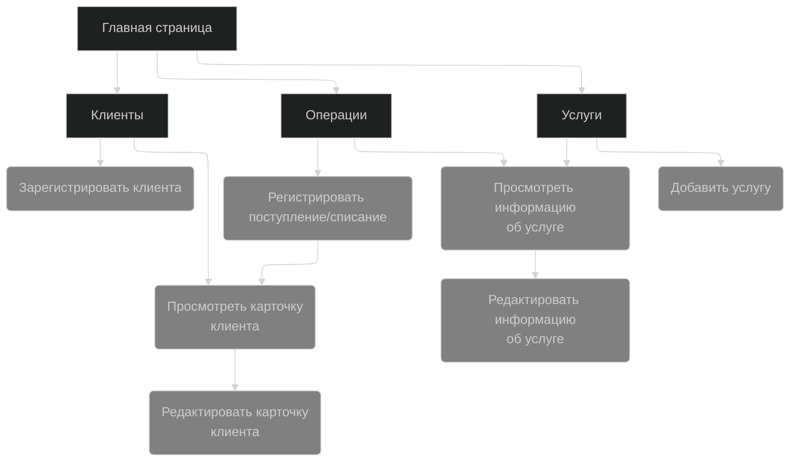
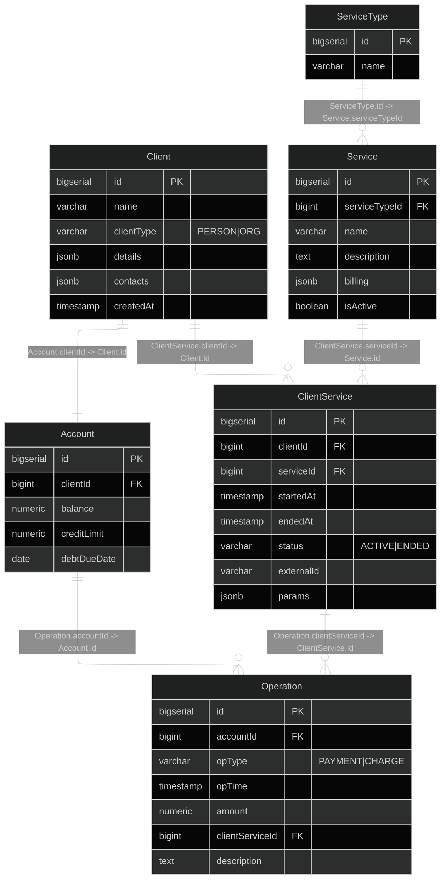

Биллинговая база оператора связи
=
## Описание веб-сайта и его страниц
В этом проекте можно выделить основные 3 сущности: **Клиент**, **услуга**, **операция**. 

Предлагается разделить сайт на 4 страницы:
- Главная страница, которая агрегирует другие страницы. На ней так же будет справка.
- Страница для работы со списком клиентов.
- Страница для работы со списком услуг.
- Страница для работы с операциями.

Ниже прикреплена схема сайта с действиями, которые можно на нём выполнить:

## Схема базы данных

# TODO
- [x] Сценарии использования
- [x] Схема навигации по сайту
- [x] Схема базы данных
- [x] Сделать скелет проекта 
- [x] Добавить скрипт инициализации БД
- [x] Добавить задачи создания, заполнения, отчистки и вывода содержимого бд.
- [ ] Back-End
- [ ] Front-End