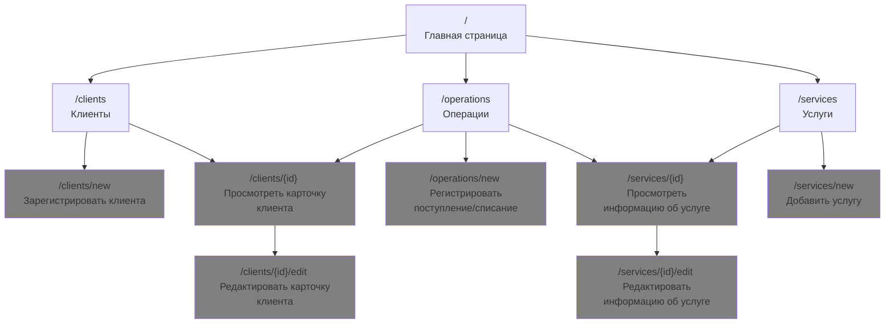
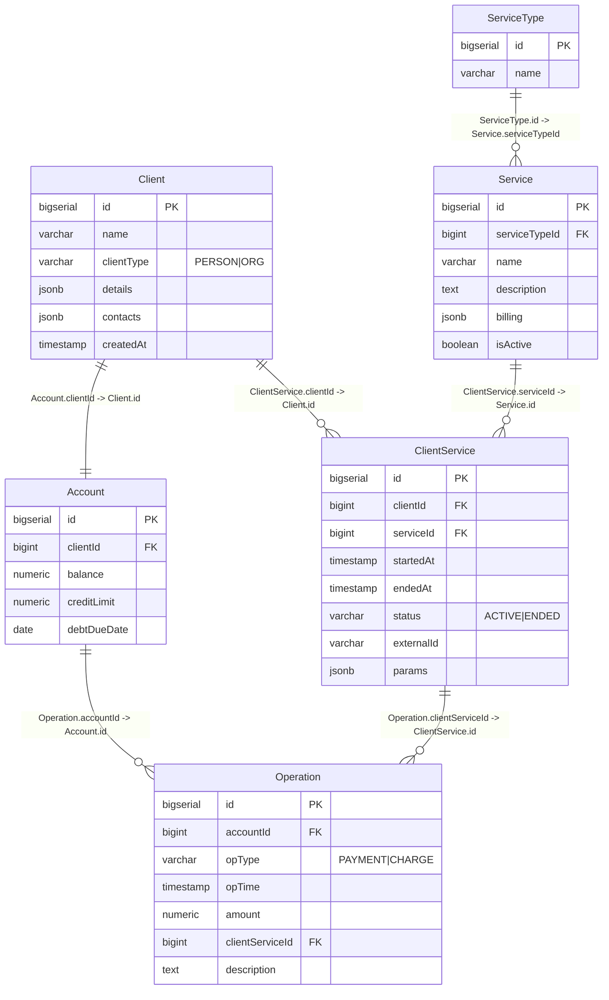

Биллинговая база оператора связи
=
## Описание веб-сайта и его страниц
В этом проекте можно выделить основные 3 сущности: **Клиент**, **услуга**, **операция**. 

Предлагается разделить сайт на 4 основные страницы:
- Главная страница, которая агрегирует другие страницы. На ней так же будет справка.
- Страница для работы со списком клиентов.
- Страница для работы со списком услуг.
- Страница для работы с операциями.

И 7 вспомогательных, на которых можно выполнить следующие действия:
- Страница регистрации клиента
- Карточка клиента
- Редактирование карточки клиента
- Регистрация поступления/списания
- Информация об услуге
- Редактирование услуги
- Добавление услуги

Ниже прикреплена схема сайта с действиями, которые можно на нём выполнить:

Более подробно ознакомится со сценариями использования можно [здесь](./docs/usercases.md). 
Более подробно ознакомится со схемой сайта можно [здесь](./docs/site-struct.md).

## Схема базы данных

Описания таблиц и JSON-схем, используемых в таблицах можно посмотреть [здесь](./docs/database.md).

# TODO
- [x] Сценарии использования
- [x] Схема навигации по сайту
- [x] Схема базы данных
- [x] Сделать скелет проекта 
- [x] Добавить скрипт инициализации БД
- [x] Добавить задачи создания, заполнения, отчистки и вывода содержимого бд.
- [ ] Back-End
- [ ] Front-End