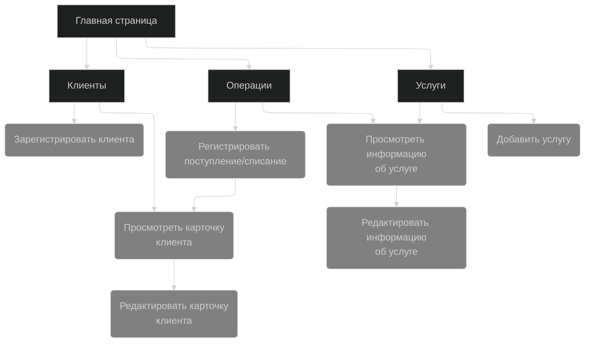
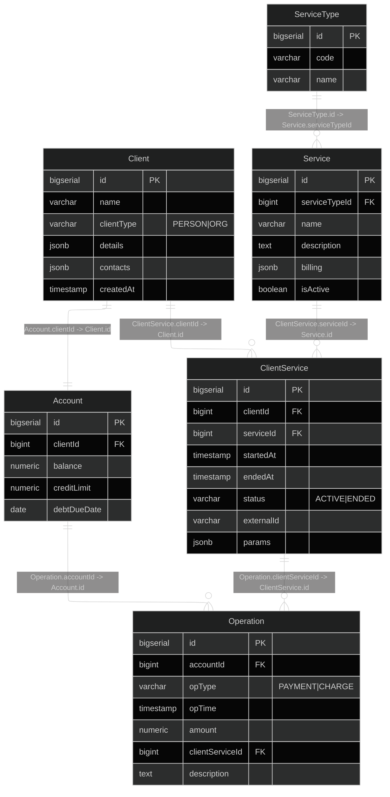

Биллинговая база оператора связи
=

## Сценарии использования
### 1. Просмотр списка клиентов

Пользователь открывает страницу со списком клиентов и видит таблицу со всеми зарегистрированными клиентами. 
В таблице отображается основная информация: тип клиента (физическое лицо или организация), 
ФИО или название, а также текущий баланс. Пользователь может пролистывать список,
искать клиента по имени или названию и перейти в карточку конкретного клиента для просмотра подробной информации.

---

### 2. Поиск клиентов по услугам за период времени

Пользователь открывает страницу поиска и выбирает услугу, а также указывает интервал времени, 
например с одной даты по другую. После нажатия кнопки поиска система показывает список клиентов, 
которым в указанный период оказывалась выбранная услуга. 
В результатах отображается краткая информация о клиентах и возможность перейти в их карточку.

---

### 3. Поиск клиентов по состоянию счета

Пользователь задает параметры поиска, связанные со счетом клиента, например отрицательный баланс, 
превышение кредитного лимита или наличие просроченной задолженности. 
После выполнения поиска система отображает список клиентов, которые соответствуют заданным условиям. 
Пользователь может открыть карточку любого из найденных клиентов.

---

### 4. Просмотр карточки клиента

Пользователь открывает карточку клиента и видит подробную информацию о нем. 
Отображаются основные данные, контактная информация, список подключенных услуг с датами начала и окончания,
а также текущее состояние счета. Из карточки можно перейти к операциям по счету, 
подключить новую услугу или отредактировать данные клиента.

---

### 5. Добавление нового клиента

Пользователь нажимает кнопку добавления клиента и выбирает тип клиента: физическое лицо или организация. 
Затем он вводит необходимые данные, такие как ФИО или название компании, контактную информацию и сохраняет запись. 
После сохранения система создает нового клиента и открывает его карточку.

---

### 6. Редактирование и удаление клиента

Пользователь может изменить данные клиента, открыв его карточку и выбрав режим редактирования.
После внесения изменений данные сохраняются в системе. Также предусмотрена возможность удаления клиента,
если это допустимо (например, если нет активных услуг или задолженности). 
В случае невозможности удаления система выводит сообщение об ошибке.

---

### 7. Управление услугами

Пользователь открывает страницу со списком услуг и видит перечень доступных услуг с их характеристиками. 
Можно добавить новую услугу, указав ее название и тип, а также настроить тарифный план. 
Также можно редактировать или удалять существующие услуги. 
Все изменения сохраняются в системе и становятся доступными для подключения клиентам.

---

### 8. Регистрация договора на оказание услуги

Пользователь в карточке клиента выбирает подключение новой услуги. 
Он выбирает услугу из списка, указывает дату начала оказания услуги 
и при необходимости дополнительные параметры (например номер телефона или пакет).
После подтверждения услуга считается подключенной и отображается в списке услуг клиента.

---

### 9. Отключение услуги

Пользователь в карточке клиента выбирает одну из активных услуг и завершает ее оказание. 
Указывается дата окончания услуги, после чего услуга переносится в историю и больше не считается активной.

---

### 10. Просмотр операций по счету

Пользователь открывает раздел операций по счету клиента и задает интервал времени. 
Система отображает список всех поступлений и списаний за выбранный период, включая дату, тип операции и сумму. 
Также показывается итоговое изменение баланса за период.

---

### 11. Регистрация поступления на счет

Пользователь добавляет платеж в счет клиента, указывая сумму и дату операции. 
После подтверждения система создает запись о поступлении и увеличивает баланс клиента на указанную сумму.

---

### 12. Регистрация списания за оказанные услуги

Пользователь добавляет списание со счета клиента, выбирая услугу и указывая сумму или период начисления. 
После подтверждения система создает запись о списании и уменьшает баланс. 
Если баланс становится ниже допустимого кредитного лимита, система фиксирует это и может отразить наличие задолженности.

## Описание веб-сайта и его страниц
Из выше перечисленных страниц можно выделить основные 3 сущности: **Клиент**, **услуга**, **операция**. 

Предлагается разделить сайт на 4 страницы:
- Главная страница, которая агрегирует другие страницы. На ней так же будет справка.
- Страница для работы со списком клиентов.
- Страница для работы со списком услуг.
- Страница для работы с операциями.

Ниже прикреплена схема сайта с действиями, которые можно на нём выполнить:

## Схема базы данных

# TODO
- [x] Сценарии использования
- [x] Схема навигации по сайту
- [x] Схема базы данных
- [x] Сделать скелет проекта 
- [x] Добавить скрипт инициализации БД
- [ ] Back-End
- [ ] Front-End