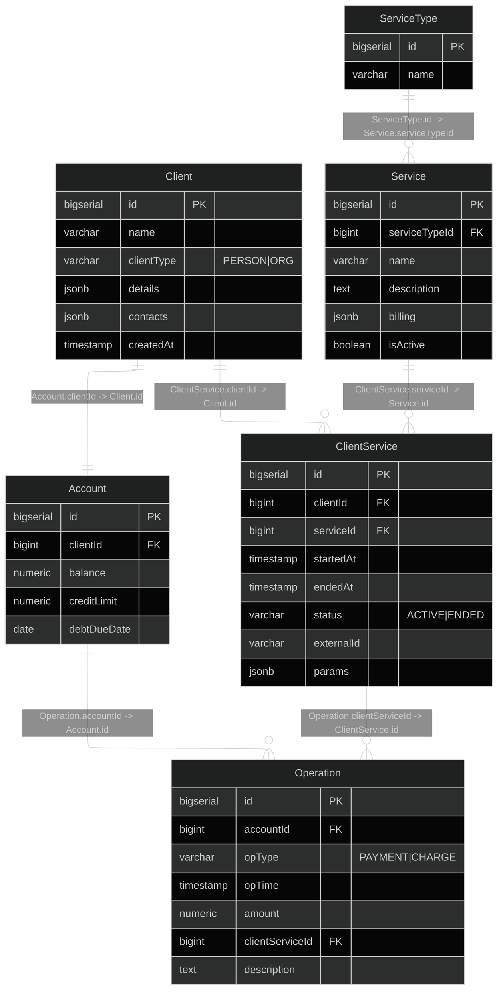

# База данных 



# Описание таблиц
Client - абонент (физлицо или организация). 
Хранит базовое имя/название и “паспортные/реквизиты” и контакты в JSON, 
чтобы не плодить отдельные таблицы. client_type показывает, Person это или Organization.

Account - счёт абонента (1 к 1 с Client). 
Тут баланс, кредитный лимит и крайний срок погашения долга (если ушёл в минус в пределах лимита).

ServiceType - справочник типов услуг (например HOME_INTERNET, PHONE_NUMBER, MOBILE_INTERNET). 
Используется скорее как группировка, чтобы в интерфейсе было удобно фильтровать/сортировать, 
но конкретные тарифы и отличия задаются на уровне самих услуг. 
Вынесено в отдельную таблицу для потенциального расширения типов услуг.
На данный момент будут поддерживаться следующие типы услуг:
- MOBILE_VOICE - номер телефона
- MOBILE_INTERNET - мобильный интернет
- SMS

Service - каталог услуг (например “Mobile internet 20GB”). 
В billing лежат тарифные/биллинговые параметры в JSON, 
чтобы можно было по-разному описывать услуги без большого количества колонок.

ClientService - конкретное подключение услуги клиенту (история оказания услуг). 
Тут видно когда началась услуга, когда закончилась, активна ли сейчас, и 
есть external_id (например номер телефона или id договора). 
В params лежат параметры именно этого подключения (например выбранный пакет, статический ip и т.п.).

Operation - журнал финансовых операций по счетам (immutable log). 
Тип операции: Payment (пополнение) или Charge (списание). 
Если списание относится к конкретной услуге, то client_service_id указывает на неё, 
иначе NULL (обычно для пополнений).

# Описание JSON cхем:
## Client.details
В случае clientType = ORG (поля заполнены для примера):
```json
{
    "legalName": "Tech Solutions LLC",
    "inn": "7701234567",
    "kpp": "770101001",
    "ogrn": "1027700132195",
    "legalAddress": "ул. Ленина, д.10, Саратов"
}
```
Все поля обязательны.

В случае clientType = PERSON (поля заполнены для примера):
```json
{
  "firstName": "Ivan",
  "lastName": "Petrov",
  "middleName": "Sergeevich",
  "birthDate": "1995-04-12",
  "sex": "Male",
  "inn": "123456789012",
  "document": {
    "type": "PASSPORT",
    "series": "1234",
    "number": "567890",
    "issuedBy": "ГУ МВД РОССИИ ПО Г.МОСКВЕ",
    "issuedAt": "2015-06-01"
  },
  "registrationsAddress": "г. Москва ..."  
}
```
Все поля обязательны.

## Client.contacts
```json
[ 
  { "type": "EMAIL", "value": "a@b.com" }, 
  { "type": "PHONE", "value": "+79991234567" },
  ...
]
```
То есть это массив из обьектов:
```json
{ 
  "type": "EMAIL",
  "value": "ivan@mail.ru"
}
```
Где все поля обязательны, type может принимать только два значения: "EMAIL", "PHONE".


## Service.billing

В зависимости от `ServiceType.name` структура JSON в поле `Service.billing` различается.

### В случае ServiceType = MOBILE_VOICE
```json
{
  "unit": "PER_MIN",
  "basePrice": 0.10,
  "monthlyFee": 0.00,
  "includedMinutes": 0,
  "callSetupFee": 0.00
}
```

Обязательные поля:

* `unit`
* `basePrice`

Допустимые значения:

* `unit` может принимать только значение `"PER_MIN"`
* `basePrice` ≥ 0

Остальные поля опциональны.

### В случае ServiceType = MOBILE_INTERNET
```json
{
  "unit": "PER_MONTH",
  "basePrice": 12.00,
  "quotaGb": 20,
  "overagePricePerGb": 0.00,
  "speedLimitAfterQuotaMbps": 0
}
```
Обязательные поля:

* `unit`
* `basePrice`
* `quotaGb`

Допустимые значения:
* `unit` может принимать только значение `"PER_MONTH"`
* `quotaGb` > 0
* `basePrice` ≥ 0

Остальные поля опциональны.

### В случае ServiceType = SMS
```json
{
  "unit": "PER_SMS",
  "basePrice": 0.05,
  "bundleSize": 0,
  "bundlePrice": 0.00
}
```
Обязательные поля:
* `unit`
* `basePrice`

Допустимые значения:
* `unit` может принимать только значение `"PER_SMS"`
* `basePrice` ≥ 0
* `bundleSize` ≥ 0

Остальные поля опциональны.

## ClientService.params
Структура JSON в поле `ClientService.params` зависит от `ServiceType` подключённой услуги.
### В случае ServiceType = MOBILE_VOICE
```json
{
  "tariff": "standard",
  "callerIdEnabled": true
}
```
Обязательные поля:
* `tariff`

### В случае ServiceType = MOBILE_INTERNET
```json
{
  "tariff": "mobile-20gb",
  "quotaGb": 20,
  "autoRenew": false,
}
```
Обязательные поля:
- `tariff`
`quotaGb` может использоваться для индивидуальной настройки квоты в рамках подключения.
Остальные поля опциональны.

### В случае ServiceType = SMS
```json
{
  "tariff": "standard",
  "senderName": null
}
```
Поле `tariff` является обязательным.
`senderName` используется при необходимости задания имени отправителя и является опциональным.


