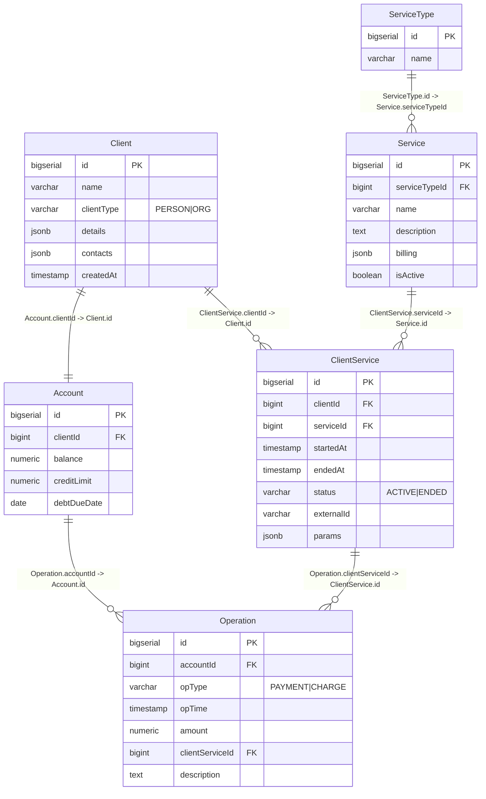

# База данных 



# Описание таблиц
Client - абонент (физлицо или организация). 
Хранит базовое имя/название и “паспортные/реквизиты” и контакты в JSON, 
чтобы не плодить отдельные таблицы. client_type показывает, Person это или Organization.

Account - счёт абонента (1 к 1 с Client). 
Тут баланс, кредитный лимит и крайний срок погашения долга (если ушёл в минус в пределах лимита).

ServiceType - справочник типов услуг (например HOME_INTERNET, PHONE_NUMBER, MOBILE_INTERNET). 
Используется скорее как группировка, чтобы в интерфейсе было удобно фильтровать/сортировать, 
но конкретные тарифы и отличия задаются на уровне самих услуг. 
Вынесено в отдельную таблицу для потенциального расширения типов услуг.
На данный момент будут поддерживаться следующие типы услуг:
- MOBILE_VOICE - номер телефона
- MOBILE_INTERNET - мобильный интернет
- SMS

Service - каталог услуг (например “Mobile internet 20GB”). 
В billing лежат тарифные/биллинговые параметры в JSON, 
чтобы можно было по-разному описывать услуги без большого количества колонок.

ClientService - конкретное подключение услуги клиенту (история оказания услуг). 
Тут видно когда началась услуга, когда закончилась, активна ли сейчас, и 
есть external_id (например номер телефона или id договора). 
В params лежат параметры именно этого подключения (например выбранный пакет, статический ip и т.п.).

Operation - журнал финансовых операций по счетам (immutable log). 
Тип операции: Payment (пополнение) или Charge (списание). 
Если списание относится к конкретной услуге, то client_service_id указывает на неё, 
иначе NULL (обычно для пополнений).

# Описание JSON cхем:
## Client.details
В случае clientType = ORG (поля заполнены для примера):

```json
{
    "legalName": "Tech Solutions LLC",
    "inn": "7701234567",
    "kpp": "770101001",
    "ogrn": "1027700132195",
    "legalAddress": "ул. Ленина, д.10, Саратов"
}
```

Все поля обязательны.

`legalName` - строка. Полное юридическое наименование организации. Используется для отображения в карточке клиента и для идентификации юридического лица в документах.
`inn` - строка. ИНН организации. Используется как идентификатор в учётных данных.
`kpp` - строка. КПП организации. Используется как реквизит юридического лица.
`ogrn` - строка. ОГРН организации. Используется как реквизит юридического лица.
`legalAddress` - строка. Юридический адрес организации. Используется для отображения и хранения адреса регистрации.

В случае clientType = PERSON (поля заполнены для примера):

```json
{
  "firstName": "Ivan",
  "lastName": "Petrov",
  "middleName": "Sergeevich",
  "birthDate": "1995-04-12",
  "sex": "Male",
  "inn": "123456789012",
  "document": {
    "type": "PASSPORT",
    "series": "1234",
    "number": "567890",
    "issuedBy": "ГУ МВД РОССИИ ПО Г.МОСКВЕ",
    "issuedAt": "2015-06-01"
  },
  "registrationsAddress": "г. Москва ..."  
}
```

Все поля обязательны.

`firstName` - строка. Имя физического лица.
`lastName` - строка. Фамилия физического лица.
`middleName` - строка. Отчество физического лица.
`birthDate` - строка (дата в формате YYYY-MM-DD). Дата рождения.
`sex` - строка. Пол. На данном этапе используется как текстовое поле, допустимые значения задаются проектом (например, Male/Female).
`inn` - строка. ИНН физического лица.
`document` - объект. Паспортные данные (или иной документ, если расширять модель).
`document.type` - строка. Тип документа. На данном этапе используется значение PASSPORT.
`document.series` - строка. Серия документа.
`document.number` - строка. Номер документа.
`document.issuedBy` - строка. Кем выдан документ.
`document.issuedAt` - строка (дата в формате YYYY-MM-DD). Дата выдачи документа.
`registrationsAddress` - строка. Адрес регистрации физического лица.

---

## Client.contacts

```json
[ 
  { "type": "EMAIL", "value": "a@b.com" }, 
  { "type": "PHONE", "value": "+79991234567" },
  ...
]
```

То есть это массив из обьектов:

```json
{ 
  "type": "EMAIL",
  "value": "ivan@mail.ru"
}
```

Где все поля обязательны, type может принимать только два значения: "EMAIL", "PHONE".

`type` - строка. Тип контакта. Возможные значения: EMAIL (электронная почта), PHONE (телефон). Используется для понимания, как интерпретировать поле value и как отображать контакт.
`value` - строка. Значение контакта. Для EMAIL содержит email-адрес, для PHONE содержит телефонный номер в текстовом виде (рекомендуемый формат: +7…, но хранится как строка без дополнительных ограничений на уровне JSON).

---

## Service.billing

В зависимости от `ServiceType.name` структура JSON в поле `Service.billing` различается.

### В случае ServiceType = MOBILE_VOICE

```json
{
  "unit": "PER_MIN",
  "basePrice": 0.10,
  "monthlyFee": 0.00,
  "includedMinutes": 0,
  "callSetupFee": 0.00
}
```

Обязательные поля: `unit`, `basePrice`.
Остальные поля опциональны.

`unit` - строка. Единица тарификации. Для голосовой связи фиксированное значение PER_MIN, означает, что списание выполняется за минуту.
`basePrice` - число (decimal). Базовая стоимость единицы тарификации, то есть цена одной минуты. Значение должно быть неотрицательным.
`monthlyFee` - число (decimal). Абонентская плата в месяц. Если поле отсутствует или равно 0, считается что абонентской платы нет.
`includedMinutes` - число (integer). Количество включённых минут в месяц. Если 0, включённого пакета нет.
`callSetupFee` - число (decimal). Стоимость установления соединения (разовый платёж за звонок). Если 0, плата за соединение отсутствует.

### В случае ServiceType = MOBILE_INTERNET

```json
{
  "unit": "PER_MONTH",
  "basePrice": 12.00,
  "quotaGb": 20,
  "overagePricePerGb": 0.00,
  "speedLimitAfterQuotaMbps": 0
}
```

Обязательные поля: `unit`, `basePrice`, `quotaGb`.
Остальные поля опциональны.

`unit` - строка. Единица тарификации. Для мобильного интернета фиксированное значение PER_MONTH, означает оплату за месяц.
`basePrice` - число (decimal). Стоимость тарифа в месяц. Значение должно быть неотрицательным.
`quotaGb` - число (integer). Квота трафика (в ГБ) на месяц. Должна быть больше 0.
`overagePricePerGb` - число (decimal). Цена за 1 ГБ сверх квоты. Если 0, перерасход либо не тарифицируется, либо не допускается (логика определяется правилами проекта).
`speedLimitAfterQuotaMbps` - число (integer). Ограничение скорости после исчерпания квоты (в Мбит/с). Если 0, ограничение не применяется или не используется.

### В случае ServiceType = SMS

```json
{
  "unit": "PER_SMS",
  "basePrice": 0.05,
  "bundleSize": 0,
  "bundlePrice": 0.00
}
```

Обязательные поля: `unit`, `basePrice`.
Остальные поля опциональны.

`unit` - строка. Единица тарификации. Для SMS фиксированное значение PER_SMS, означает списание за одно сообщение.
`basePrice` - число (decimal). Стоимость одной SMS. Значение должно быть неотрицательным.
`bundleSize` - число (integer). Размер пакета SMS. Если 0, пакет не используется.
`bundlePrice` - число (decimal). Стоимость пакета SMS. Используется только если bundleSize больше 0.

---

## ClientService.params

Структура JSON в поле `ClientService.params` зависит от `ServiceType` подключённой услуги.

### В случае ServiceType = MOBILE_VOICE

```json
{
  "tariff": "standard",
  "callerIdEnabled": true
}
```

`tariff` - строка. Идентификатор/код выбранного тарифа в рамках подключения услуги. Используется для того, чтобы у одного и того же типа услуги могло быть несколько тарифных вариантов. Обязательное поле.
`callerIdEnabled` - boolean. Признак включения услуги определения номера (Caller ID). Если поле отсутствует, значение считается false или определяется логикой приложения.

### В случае ServiceType = MOBILE_INTERNET

```json
{
  "tariff": "mobile-20gb",
  "quotaGb": 20,
  "autoRenew": false
}
```

`tariff` - строка. Идентификатор/код выбранного тарифа в рамках подключения услуги. Обязательное поле.
`quotaGb` - число (integer). Индивидуальная квота трафика (в ГБ) на уровне конкретного подключения. Может использоваться для настройки отличной от базовой квоты услуги. Если поле отсутствует, используется quotaGb из Service.billing.
`autoRenew` - boolean. Признак автопродления пакета/квоты (например, при исчерпании или в конце периода). Если поле отсутствует, значение считается false или задаётся логикой приложения.

### В случае ServiceType = SMS

```json
{
  "tariff": "standard",
  "senderName": null
}
```

`tariff` - строка. Идентификатор/код выбранного тарифа в рамках подключения услуги. Обязательное поле.
`senderName` - строка или null. Имя отправителя (подпись), используемое при отправке SMS, если поддерживается провайдером. Если значение null или поле отсутствует, используется отправка без пользовательского имени (или имя по умолчанию).
