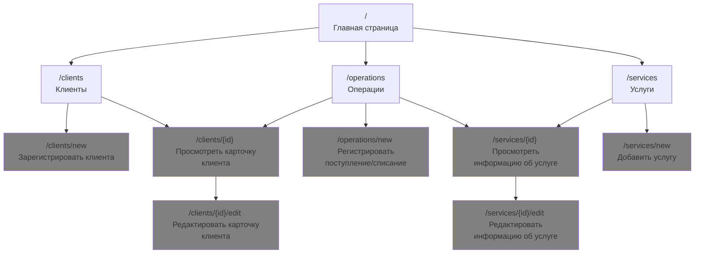

# Структура сайта

## Навигационное меню (доступно на всех страницах)

Главная → /
Клиенты → /clients
Услуги → /services
Операции → /operations

---

## Главная страница

URL: /

На странице отображается сводная информация по системе биллинга. В верхней части находится навигационное меню. Ниже размещены информационные блоки со статистикой: общее количество клиентов, количество активных услуг, количество операций за выбранный период, количество клиентов с отрицательным балансом, количество клиентов с просроченной задолженностью. Под статистикой расположен блок выбора периода, который влияет на показатель “количество операций за выбранный период”.

Поля для ввода: “Период с” (дата) и “Период по” (дата).

Кнопки: “Обновить” — выполняет пересчёт показателей с учётом выбранного периода и оставляет пользователя на странице /. Кнопки “Клиенты”, “Услуги”, “Операции” выполняют переход на соответствующие разделы: /clients, /services, /operations.

---

## Клиенты

URL: /clients

На странице отображается список клиентов и инструменты для поиска. В верхней части находится навигационное меню. Основная часть страницы — таблица “Клиенты”, где каждая строка соответствует одному клиенту. В строке выводятся следующие данные: ID клиента, тип клиента (PERSON или ORG), имя/наименование, баланс, кредитный лимит, срок погашения задолженности, дата создания. В конце строки находится колонка “Действия”. В колонке “Действия” расположены ссылки/кнопки “Открыть” и “Редактировать”. При нажатии “Открыть” выполняется переход на страницу карточки клиента /clients/{id}. При нажатии “Редактировать” выполняется переход на страницу редактирования /clients/{id}/edit.

Над таблицей расположен блок фильтров. Он включает поле “Поиск по имени/названию” для поиска по строке, выпадающий список “Тип клиента” со значениями “Все”, “PERSON”, “ORG”, а также фильтр “Состояние счёта” со значениями “Все”, “Отрицательный баланс”, “Просроченная задолженность”. После заполнения фильтров пользователь нажимает кнопку “Найти”, и таблица обновляется с учётом заданных условий, оставаясь на /clients. Кнопка “Сбросить” очищает значения фильтров и возвращает отображение полного списка. Кнопка “Добавить клиента” переводит на страницу регистрации клиента /clients/new.

---

## Страница регистрации клиента

URL: /clients/new

На странице находится форма создания нового клиента. В верхней части доступно навигационное меню. В форме есть поле выбора “Тип клиента” (PERSON или ORG) и поле “Имя/Наименование”. Также есть блок “Контакты”, который представлен списком контактов. Для каждого контакта задаётся “Тип контакта” (EMAIL или PHONE) и “Значение”. Рядом находятся кнопки управления списком: “Добавить контакт” добавляет новую строку контакта, “Удалить контакт” удаляет выбранную строку контакта.

Ниже расположен блок “Реквизиты / Паспортные данные”, который зависит от выбранного типа клиента. Для ORG отображаются поля: полное наименование, ИНН, КПП, ОГРН, юридический адрес. Для PERSON отображаются поля: фамилия, имя, отчество, дата рождения, пол, ИНН, тип документа, серия документа, номер документа, кем выдан, дата выдачи, адрес регистрации.

Кнопка “Сохранить” создаёт клиента и связанный с ним счёт, после чего выполняется переход на /clients. Кнопка “Отмена” отменяет создание и выполняет переход на /clients без сохранения.

---

## Страница клиента

URL: /clients/{id}

На странице отображается карточка выбранного клиента. В верхней части находится навигационное меню. В карточке показаны основные сведения: ID, тип, имя/наименование, дата создания, контакты (в виде списка), детали клиента в формате ключ–значение, а также данные счёта: баланс, кредитный лимит, срок погашения задолженности.

Ниже размещена таблица “Подключенные услуги”. Каждая строка содержит название услуги, тип услуги (MOBILE_VOICE, MOBILE_INTERNET или SMS), статус (ACTIVE или ENDED), дату начала, дату окончания, внешний идентификатор и колонку “Действия”. В колонке “Действия” доступна ссылка “Перейти к услуге”, которая переводит на страницу услуги /services/{id}. Также для активных подключений доступна кнопка “Отключить”: при нажатии фиксируется дата окончания подключения, статус меняется на ENDED, после чего пользователь остаётся на странице /clients/{id}.

Кнопка “Редактировать клиента” переводит на /clients/{id}/edit. Кнопка “Просмотреть операции клиента” переводит на /operations и сразу применяет фильтр по выбранному клиенту (то есть на странице операций показываются операции только этого клиента). Кнопка “Назад к списку” возвращает на /clients.

---

## Страница редактирования клиента

URL: /clients/{id}/edit

На странице отображается форма редактирования клиента, по составу полей она соответствует странице /clients/new, но все поля уже заполнены текущими значениями клиента. После изменения данных пользователь нажимает “Сохранить”, тогда данные обновляются и выполняется переход на /clients/{id}. Если нажать “Отмена”, изменения не сохраняются и выполняется переход на /clients/{id}.

---

## Услуги

URL: /services

На странице отображается список услуг и инструменты поиска. В верхней части находится навигационное меню. Основная часть страницы — таблица “Услуги”. В каждой строке выводятся ID, название, тип услуги (MOBILE_VOICE, MOBILE_INTERNET или SMS), краткое описание, базовая стоимость, признак активности (Да/Нет) и колонка “Действия”. В колонке “Действия” доступны элементы “Просмотр” и “Редактировать”. “Просмотр” переводит на /services/{id}. “Редактировать” переводит на /services/{id}/edit.

Над таблицей расположен блок фильтров, который включает поиск по названию, выбор типа услуги и выбор статуса (Все/Активные/Неактивные). Кнопка “Найти” применяет фильтры и обновляет список, оставаясь на /services. Кнопка “Сбросить” очищает фильтры. Кнопка “Добавить услугу” переводит на /services/new.

---

## Страница добавления услуги

URL: /services/new

На странице представлена форма создания услуги. В верхней части доступно навигационное меню. В форме есть поля: название, тип услуги (MOBILE_VOICE, MOBILE_INTERNET или SMS), описание, активность. Также присутствует блок “Параметры тарификации”. Он обязательно включает базовую стоимость и может содержать дополнительные параметры, которые зависят от выбранного типа услуги (например, разные параметры для голосовой связи, интернета или SMS).

Кнопка “Сохранить” создаёт услугу и переводит на /services. Кнопка “Отмена” возвращает на /services без сохранения.

---

## Страница услуги

URL: /services/{id}

На странице отображается информация об услуге. В верхней части находится навигационное меню. В карточке услуги выводятся ID, название, тип услуги, описание, полные параметры тарификации и статус активности. Кнопка “Редактировать” переводит на /services/{id}/edit. Кнопка “Назад к списку” переводит на /services.

---

## Страница редактирования услуги

URL: /services/{id}/edit

На странице расположена форма редактирования услуги. Она соответствует по составу полей странице /services/new, но поля заполнены текущими значениями. Кнопка “Сохранить” сохраняет изменения и переводит на /services/{id}. Кнопка “Отмена” отменяет изменения и переводит на /services/{id}.

---

## Операции

URL: /operations

На странице отображается журнал операций. В верхней части доступно навигационное меню. Основная часть страницы — таблица “Операции”. В каждой строке выводятся дата и время, тип операции (PAYMENT или CHARGE), сумма, клиент (в виде ссылки), услуга (если указана, также ссылка) и описание. При нажатии на клиента выполняется переход на /clients/{id}. При нажатии на услугу выполняется переход на /services/{id}.

Над таблицей расположен блок фильтров: период с, период по, тип операции, клиент, услуга. Кнопка “Показать” применяет фильтры и обновляет таблицу, оставаясь на /operations. Кнопка “Сбросить” очищает фильтры и показывает все операции. Кнопка “Добавить операцию” переводит на страницу создания операции /operations/new.

---

## Страница добавления операции

URL: /operations/new

На странице находится форма добавления операции. В верхней части доступно навигационное меню. В форме задаются: клиент, тип операции (PAYMENT или CHARGE), дата и время, сумма, описание. Дополнительно есть поле “Подключённая услуга”, оно необязательное и используется только для операции типа CHARGE.

Кнопка “Сохранить” создаёт операцию, пересчитывает баланс клиента и выполняет переход на /operations. Кнопка “Отмена” отменяет создание операции и выполняет переход на /operations.
